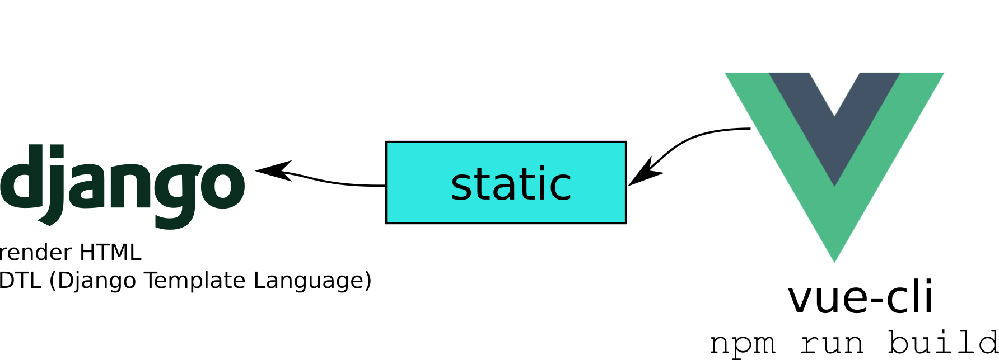

# django-vuejs-02-vue-cli-static

Projeto feito com Django e VueJS embutido como arquivo estático após o build.


Neste projeto eu uso [Django][1] e sua renderização tradicional de templates, e uso o [VueJS][2] com todos os recursos que o [vue-cli](https://cli.vuejs.org/) pode oferecer.




## Como rodar o projeto?

Em Dev rodar dois servidores, back e front.

Depois fazer `npm run build` para gerar os arquivos pra rodar somente com Django.

### Backend

* Clone esse repositório.
* Crie um virtualenv com Python 3.
* Ative o virtualenv.
* Instale as dependências.
* Rode as migrações.

```
git clone https://github.com/rg3915/django-vuejs-02-vue-cli-static.git
cd django-vuejs-02-vue-cli-static
python -m venv .venv
source .venv/bin/activate
pip install -r requirements.txt
python contrib/env_gen.py
python manage.py migrate
```

### Frontend

Para gerar o build, faça:

```
cd frontend
npm install  # primeiro precisa instalar o vue e suas dependências.
npm run build
```

Com isso você pode rodar somente o Django.

```
python manage.py runserver
```


#### Servindo o front

Se você quiser rodar somente o frontend separado, em ambiente de Dev, faça:

```
npm run serve
```

Isso vai rodar o servidor de front na porta 8080.


## Comandos pra criar o projeto do zero

### Criando o projeto Django

```
python -m venv .venv
source .venv/bin/activate
pip install -U pip; pip install django==2.2.12 django-extensions python-decouple dj-database-url
django-admin startproject myproject .
cd myproject
python ../manage.py startapp core
cd ..
python manage.py migrate
# Crie um super usuário
python manage.py createsuperuser --username="admin"
```

#### Criando uma pasta chamada contrib com um env_gen.py

O comando a seguir pega `env_gen.py` do gist e clona na pasta `/tmp`.

[nvm gist][4]

```
git clone https://gist.github.com/22626de522f5c045bc63acdb8fe67b24.git /tmp/contrib; if [ ! -d contrib ]; then mkdir contrib; fi; cp /tmp/contrib/env_gen.py contrib/
# rode este comando para gerar o .env (variáveis de ambiente).
python contrib/env_gen.py
```

Em `settings.py` insira em `INSTALLED_APPS`...

```
INSTALLED_APPS = [
    ...
    'django_extensions',
    'myproject.core'
]
```

Edite este trecho do `settings.py`:

```
import os
from decouple import config, Csv
from dj_database_url import parse as dburl

BASE_DIR = os.path.dirname(os.path.dirname(os.path.abspath(__file__)))

# SECURITY WARNING: keep the secret key used in production secret!
SECRET_KEY = config('SECRET_KEY')

# SECURITY WARNING: don't run with debug turned on in production!
DEBUG = config('DEBUG', default=False, cast=bool)

ALLOWED_HOSTS = config('ALLOWED_HOSTS', default=[], cast=Csv())
```

E este trecho, onde vamos usar o sqlite:

```
default_dburl = 'sqlite:///' + os.path.join(BASE_DIR, 'db.sqlite3')
DATABASES = {
    'default': config('DATABASE_URL', default=default_dburl, cast=dburl),
}
```

No final do arquivo também edite:

```
LANGUAGE_CODE = 'pt-br'

TIME_ZONE = 'America/Sao_Paulo'
```

E

```
STATIC_URL = '/static/'
STATIC_ROOT = os.path.join(BASE_DIR, 'staticfiles')
```

Se você mudar a pasta default dos estáticos, então faça:

```
# opcional
STATICFILES_DIRS = [
    os.path.join(BASE_DIR, "static"),
    'myproject/core/templates/static/',
]
```

Depois entre na pasta

```
cd myproject/core/
```

e vamos editar o `views.py`.

```
cat << EOF > views.py
from django.shortcuts import render


def index(request):
    return render(request, 'index.html')
EOF
```

Agora vamos criar um `urls.py` na pasta `core`.

```
cat << EOF > urls.py
from django.urls import path
from myproject.core import views as v


app_name = 'core'


urlpatterns = [
    path('', v.index, name='index'),
]
EOF
```

Volte para a pasta `myproject` e edite o `urls.py` principal:

```
cd ..

cat << EOF > urls.py
from django.contrib import admin
from django.urls import include, path

urlpatterns = [
    path('', include('myproject.core.urls')),
    path('admin/', admin.site.urls),
]
EOF
```

Basicamente o backend está pronto.

Agora vamos para o front.

### Frontend

Volte para a pasta principal do projeto:

Eu estou usando o Node 12, que instalei via [nvm][4].

```
# pasta principal do projeto
cd ..
nvm use 12
vue create frontend
cd frontend
```

#### Criando um arquivo de configuração

```
cat << EOF > vue.config.js
module.exports = {
  outputDir: '../myproject/core/templates',
  assetsDir: '../static'
}
EOF
```

Para gerar o build, faça:

```
npm run build
```

Com isso você pode rodar somente o Django.


#### Servindo o front

Se você quiser rodar somente o frontend separado, em ambiente de Dev, faça:

```
npm run serve
```

Isso vai rodar o servidor de front na porta 8080.

#### Rodando o servidor Django

```
cd ..
python manage.py runserver
```


[1]: https://www.djangoproject.com/
[2]: https://vuejs.org/
[3]: https://github.com/axios/axios
[4]: https://gist.github.com/rg3915/6fad3d19f2b511ec5da40cef5a168ca5
